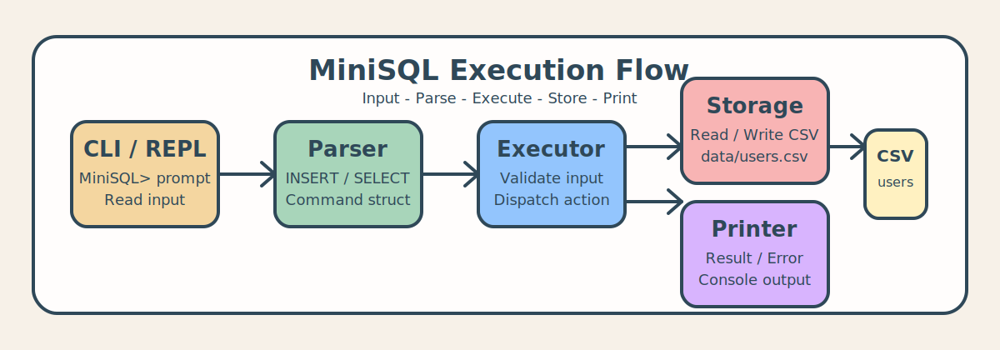
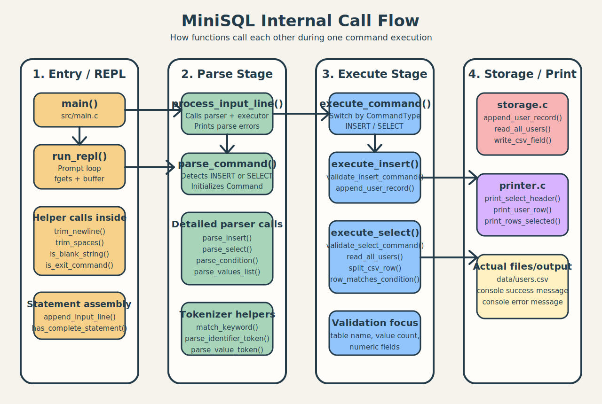

# SQL Processor Study Project

이 프로젝트는 C 언어로 구현한 파일 기반 `MiniSQL` 처리기이다.  
핵심 목표는 DBMS 전체를 만드는 것이 아니라, `입력 -> 파싱 -> 실행 -> 저장 -> 출력` 흐름을 직접 구현하면서 SQL 처리기의 기본 구조를 이해하는 것이다.

현재 버전은 `MiniSQL> ` 프롬프트를 제공하는 인터랙티브 CLI 형태로 동작하며, 하드코딩된 `users` 테이블 하나에 대해 `INSERT`와 `SELECT`를 수행한다.

## 프로젝트 한눈에 보기
- 프로젝트 성격: 학습용 MiniSQL REPL
- 구현 언어: C
- 저장 방식: CSV 파일 기반
- 조회 가속 방식: `id` 컬럼용 in-memory B-tree 인덱스
- 지원 테이블: `users` 1개
- 지원 명령: `INSERT`, `SELECT`
- 실행 파일: [sql_processor](sql_processor)
- 데이터 파일: [users.csv](data/users.csv)

## 발표용 요약
이 프로젝트는 사용자가 CLI에서 MiniSQL 문장을 입력하면, 프로그램이 그 문장을 파싱해 명령 구조체로 바꾸고, 실행기에서 해당 명령을 처리한 뒤, CSV 파일에 저장하거나 파일에서 조회한 결과를 콘솔에 출력하는 구조로 동작한다. `WHERE`는 `users` 테이블의 단일 컬럼 조건을 지원하며, 특히 `WHERE id = 값` 조회는 메모리에 유지되는 B-tree 인덱스를 이용해 전체 파일 스캔 없이 한 행을 직접 찾는다.

즉, 작은 규모이지만 DB 처리기의 핵심 단계인 `Read -> Parse -> Execute -> Store -> Print`를 모두 직접 구현한 프로젝트라고 설명할 수 있다.

## 실행 흐름


흐름을 간단히 말하면 아래와 같다.

1. 사용자가 `MiniSQL> ` 프롬프트에서 명령을 입력한다.
2. `repl`이 입력을 누적해서 한 문장으로 만든다.
3. `parser`가 `INSERT` 또는 `SELECT` 문장으로 해석한다.
4. `executor`가 유효성 검사 후 `storage`를 호출한다.
5. `storage`가 [users.csv](data/users.csv)를 읽거나 쓰고, `id` 조회용 B-tree 인덱스를 유지한다.
6. `printer`가 결과 또는 오류 메시지를 출력한다.

## 함수 단위 세부 흐름


조금 더 코드 가까이에서 보면 호출 관계는 이렇게 이어진다.

1. [main.c](src/main.c) 의 `main()`이 [repl.c](src/repl.c) 의 `run_repl()`를 호출한다.
2. `run_repl()`는 `read_input_line()`으로 입력을 동적으로 읽고 `trim_newline()`, `trim_spaces()`, `is_blank_string()`으로 입력을 정리한다.
3. 여러 줄 입력일 수 있으므로 `append_input_line()`이 `realloc()`으로 버퍼를 키우며 누적하고, `has_complete_statement()`로 세미콜론이 나왔는지 확인한다.
4. 문장이 완성되면 `process_input_line()`이 [parser.c](src/parser.c) 의 `parse_command()`를 호출한다.
5. `parse_command()`는 내부에서 `parse_insert()` 또는 `parse_select()`를 호출하고, 필요하면 `parse_condition()`, `parse_values_list()`, `parse_value_token()`까지 내려가면서 `Command` 구조체를 채운다.
6. 파싱이 성공하면 `process_input_line()`이 [executor.c](src/executor.c) 의 `execute_command()`를 호출한다.
7. `execute_command()`는 명령 종류에 따라 `execute_insert()` 또는 `execute_select()`로 분기한다.
8. `execute_insert()`는 `validate_insert_command()`로 값 개수와 숫자 필드를 검사한 뒤, [storage.c](src/storage.c) 의 `append_user_record()`를 호출한다.
9. `execute_select()`는 `validate_select_command()` 후 `WHERE id = 값`이면 `read_user_row_by_id()`로 B-tree 인덱스를 사용하고, 다른 컬럼 조건이나 전체 조회면 `read_all_users()`로 CSV를 동적 배열에 읽는다.
10. 조회 결과는 [printer.c](src/printer.c) 의 `print_select_header()`, `print_user_row()`, `print_rows_selected()`로 출력되고, INSERT 성공 시에는 `print_message()`가 호출된다.

## 현재 구현 상태
- 인터랙티브 REPL 스타일 CLI 지원
- 여러 줄 입력 지원
- 동적 입력 버퍼 사용
- `exit`, `quit`, EOF(`Ctrl + D`) 종료 지원
- `INSERT INTO users VALUES (...)`
- `SELECT * FROM users;`
- `SELECT * FROM users WHERE column = ...;`
- 문자열 컬럼은 CSV 저장 시 큰따옴표로 저장
- `WHERE`는 `users`의 단일 컬럼 조건을 지원
- `WHERE id = 값` 조회에 in-memory B-tree 인덱스 사용
- CSV row/field 일부를 동적 메모리로 관리
- 기본 오류 메시지 체계 지원

## 빌드와 실행
빌드:

```bash
make
```

실행:

```bash
./sql_processor
```

실행 예시:

```text
$ ./sql_processor
MiniSQL> SELECT * FROM users;
MiniSQL> INSERT INTO users VALUES (
...> "demo15", "Demo User", 24,
...> "010-1515-1515", "demo15@example.com"
...> );
MiniSQL> SELECT * FROM users WHERE id = 15;
MiniSQL> exit
```

## 프로젝트 구조
- [docs](docs/README.md): 설계 및 기술 문서
- [study_docs](study_docs/README.md): 초보자용 학습 문서
- [include](include/constants.h): 공용 헤더 파일
- [src](src/main.c): 실제 C 소스 코드
- [data](data/users.csv): CSV 데이터 파일
- [data/users.idx](data/users.idx): 인덱스 설명 파일
- [assets](assets/minisql-flow.svg): README용 다이어그램

## 문서 안내
- [문서 인덱스](docs/README.md)
- [학습 문서 인덱스](study_docs/README.md)
- [프로젝트 개요와 범위](docs/01-project-overview.md)
- [MiniSQL 문법 기초](docs/02-sql-basics.md)
- [처리 흐름 설계](docs/03-processing-flow.md)
- [저장 포맷 설계](docs/04-storage-design.md)
- [구현 계획](docs/05-implementation-plan.md)
- [하드코딩 테이블 정의](docs/06-users-table.md)
- [파일 구조와 함수 설계](docs/07-file-structure-and-functions.md)
- [MiniSQL 입력 규칙](docs/08-minisql-input-rules.md)
- [지원/미지원 문법 요약](docs/09-supported-grammar.md)

## 1차 구현 범위 요약
- `users` 테이블 하나만 지원
- `INSERT`, `SELECT`만 지원
- `WHERE`는 단일 조건만 지원
- 1차 구현은 `users`의 단일 `WHERE column = value` 조건을 지원하고, `id` 조건은 인덱스로 최적화한다.
- `UPDATE`, `DELETE`, `CREATE TABLE`, 복합 조건은 아직 지원하지 않음
