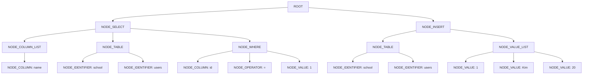

# SQLInsertSelect

SQL 문자열을 `Lexer -> Parser -> Executor` 흐름으로 처리하고, 메타정보는 CSV 파일로, 데이터는 바이너리 파일로 저장합니다.


----------------------▼28Byte


```csv
1,Kim,20
...
4,mkm,257
...
```

## 지원 기능

현재 지원하는 SQL은 아래와 같습니다.

- `INSERT INTO users VALUES (1, 'Kim', 20);`
- `INSERT INTO school.users VALUES (1, 'Kim', 20);`
- `SELECT * FROM users;`
- `SELECT * FROM school.users;`
- `SELECT name FROM users;`
- `SELECT name FROM users WHERE id = 1;`
- `SELECT * FROM users WHERE age >= 10;`

현재 `WHERE`는 단일 조건만 지원합니다.

- `=`
- `!=`
- `>`
- `>=`
- `<`
- `<=`

## 디렉터리 구조

```text
SQLInsertSelect/
├── AGENT.md
├── Makefile
├── README.md
├── meta/
│   └── school/
│       └── users.schema.csv
├── data/
│   └── school/
│       └── users.dat
├── sample_insert.sql
├── sample_select.sql
├── sample_where.sql
├── sample_where_ge.sql
├── sample_where_ne.sql
└── src/
    ├── main.c
    ├── lexer.c
    ├── parser.c
    ├── meta.c
    ├── storage.c
    ├── executor.c
    ├── util.c
    └── sql_processor.h
```

## 저장 구조

### 1. 메타 파일

메타 파일은 `meta/<schema>/<table>.schema.csv` 위치에 있습니다.

예: [users.schema.csv](C:\crafton\1\SQLInsertSelect\meta\school\users.schema.csv)

```csv
column_name,type,size
id,INT,4
name,CHAR,20
age,INT,4
```

의미:

- `id`는 4바이트 정수
- `name`은 20바이트 고정 길이 문자열
- `age`는 4바이트 정수

### 2. 데이터 파일

실제 데이터는 `data/<schema>/<table>.dat` 바이너리 파일에 저장합니다.

예: [users.dat](C:\crafton\1\SQLInsertSelect\data\school\users.dat)

현재 `users` 테이블의 row 구조는 아래와 같습니다.

- `id`: 4바이트
- `name`: 20바이트
- `age`: 4바이트

즉 row 하나 크기는 총 28바이트입니다.

```text
[id 4바이트][name 20바이트][age 4바이트]
```

데이터 파일에는 row가 연속으로 저장됩니다.

```text
[row1 28바이트][row2 28바이트][row3 28바이트]...
```

### TableMeta

메타 CSV를 읽은 뒤 실행기에 전달되는 구조입니다.

```c
typedef struct {
    char schema_name[MAX_NAME_LEN];
    char table_name[MAX_NAME_LEN];
    ColumnDef columns[MAX_COLUMNS];
    int column_count;
    int row_size;
    char data_file_path[MAX_PATH_LEN];
    char meta_file_path[MAX_PATH_LEN];
} TableMeta;
```
각 필드 의미:

- `type`: 노드 종류 (`NODE_SELECT`, `NODE_INSERT`, `NODE_TABLE` 등)
- `value_type`: 값 노드의 literal 종류 (`문자열`, `숫자`, `없음`)
- `text`: 컬럼명, 테이블명, 실제 값, 연산자 문자열
- `first_child`: 첫 번째 자식 노드
- `next_sibling`: 같은 부모의 다음 형제 노드
## 전체 실행 흐름

전체 흐름은 아래 순서입니다.

```text
입력 SQL
-> lex_sql
-> parse_statement
-> AST 생성
-> execute_statement
-> load_table_meta
-> append_binary_row / execute_select
-> 결과 출력
```

### INSERT 흐름

예:

```sql
INSERT INTO users VALUES (1, 'Kim', 20);
```

처리 순서:

1. `lex_sql()`이 SQL을 토큰 배열로 분리합니다.
2. `parse_insert()`가 `NODE_INSERT` 루트를 만듭니다.
3. `parse_table_node()`가 `TABLE -> schema/table` 구조를 만듭니다.
4. `parse_value_list_node()`가 값 목록 노드를 만듭니다.
5. `execute_statement()`가 메타 파일을 읽습니다.
6. `append_binary_row()`가 value list를 순회하며 row 버퍼를 만듭니다.
7. `fwrite()`로 `.dat` 파일 끝에 row를 추가합니다.

### SELECT 흐름

예:

```sql
SELECT name FROM users WHERE id = 1;
```

처리 순서:

1. `lex_sql()`이 SQL을 토큰 배열로 분리합니다.
2. `parse_select()`가 `NODE_SELECT` 루트를 만듭니다.
3. `parse_column_list_node()`가 조회할 컬럼 목록을 만듭니다.
4. `parse_table_node()`가 대상 테이블 노드를 만듭니다.
5. `parse_where_node()`가 `WHERE` 노드를 만듭니다.
6. `execute_statement()`가 메타 파일을 읽습니다.
7. `execute_select()`가 `.dat` 파일을 `row_size` 단위로 읽습니다.
8. `WHERE` 조건에 맞는 row만 출력합니다.

## 내부 자료구조

### ASTNode
```c
typedef enum {
    TOKEN_IDENTIFIER,      /* 일반 이름: users, age, school */
    TOKEN_STRING,          /* 문자열 literal: 'Kim' */
    TOKEN_NUMBER,          /* 숫자 literal: 10, 123 */
    TOKEN_STAR,            /* '*' */
    TOKEN_COMMA,           /* ',' */
    TOKEN_DOT,             /* '.' */
    TOKEN_LPAREN,          /* '(' */
    TOKEN_RPAREN,          /* ')' */
    TOKEN_EQUAL,           /* '=' */
    TOKEN_NOT_EQUAL,       /* '!=' */
    TOKEN_GREATER,         /* '>' */
    TOKEN_GREATER_EQUAL,   /* '>=' */
    TOKEN_LESS,            /* '<' */
    TOKEN_LESS_EQUAL,      /* '<=' */
    TOKEN_SEMICOLON,       /* ';' */
    TOKEN_EOF,             /* 입력 끝 */
    TOKEN_KEYWORD_INSERT,  /* INSERT 키워드 */
    TOKEN_KEYWORD_INTO,    /* INTO 키워드 */
    TOKEN_KEYWORD_VALUES,  /* VALUES 키워드 */
    TOKEN_KEYWORD_SELECT,  /* SELECT 키워드 */
    TOKEN_KEYWORD_FROM,    /* FROM 키워드 */
    TOKEN_KEYWORD_WHERE    /* WHERE 키워드 */
} TokenType;
```
SQL의 명령어를 노드 기반 AST로 변환한 뒤 실행합니다.


## 추상 구문 트리 (AST)
- 구문 트리는 소스 트리가 문법에 맞는지 확인하는 데 사용된다. 소스 코드를 토큰화(tokenization)한 후, 파싱(parsing) 과정을 통해 생성
- 특징
  - 정확한 문법 구조를 보여주며, 소스 코드의 세부 문법 정보를 모두 포함한다.
  - 프로그래밍 언어의 문법(Grammar) 규칙에 따라 트리 형태로 변환된다.
  - 세미콜론, 괄호 등과 같은 문법적 세부 사항도 포함된다.

## AST 예시




```c
typedef struct {
    TokenType type;
    char *text;
} Token;
```
```c
typedef struct {
    Token *items;
    int count;
} TokenArray;
```
['S','E','L','E','C','T','','U','S','E',]
    ▲cursor
- lexer
```c
if (*cursor == '*' || *cursor == ',' || *cursor == '.' || *cursor == '(' || *cursor == ')' || *cursor == ';') {
    TokenType type = TOKEN_STAR;
    switch (*cursor) {
    case '*': type = TOKEN_STAR; break;
    case ',': type = TOKEN_COMMA; break;
    case '.': type = TOKEN_DOT; break;
    case '(': type = TOKEN_LPAREN; break;
    case ')': type = TOKEN_RPAREN; break;
    case ';': type = TOKEN_SEMICOLON; break;
    }
    if (!push_token(&array, type, cursor, 1)) goto oom;
    cursor++;
    continue;
}
```

```c
typedef struct ASTNode {
    NodeType type;
    ASTValueType value_type;
    char *text;
    struct ASTNode *first_child;
    struct ASTNode *next_sibling;
} ASTNode;
```
```c
typedef struct {
    const TokenArray *tokens;
    int index;
} Parser;
- parser
  - INSERT INTO TABLE VALUES (ROW1, ROW2, ...)
```

```c
static ASTNode *parse_insert(Parser *parser, Status *status) {
    ASTNode *root;
    ASTNode *table_node;
    ASTNode *value_list_node;
if (!expect(parser, TOKEN_KEYWORD_INSERT, status, "Parse error: expected INSERT")) return NULL;
if (!expect(parser, TOKEN_KEYWORD_INTO, status, "Parse error: expected INTO")) return NULL;

table_node = parse_table_node(parser, status);
if (table_node == NULL) return NULL;

if (!expect(parser, TOKEN_KEYWORD_VALUES, status, "Parse error: expected VALUES")) {
    free_ast(table_node);
    return NULL;
}
if (!expect(parser, TOKEN_LPAREN, status, "Parse error: expected '(' after VALUES")) {
    free_ast(table_node);
    return NULL;
}

value_list_node = parse_value_list_node(parser, status);
if (value_list_node == NULL) {
    free_ast(table_node);
    return NULL;
}

if (!expect(parser, TOKEN_RPAREN, status, "Parse error: expected ')' after values")) {
    free_ast(table_node);
    free_ast(value_list_node);
    return NULL;
}
match(parser, TOKEN_SEMICOLON);
if (!expect(parser, TOKEN_EOF, status, "Parse error: unexpected tokens after statement")) {
    free_ast(table_node);
    free_ast(value_list_node);
    return NULL;
}

root = create_ast_node(NODE_INSERT, NULL, AST_VALUE_NONE);
if (root == NULL) {
    free_ast(table_node);
    free_ast(value_list_node);
    snprintf(status->message, sizeof(status->message), "Execution error: out of memory");
    return NULL;
}

append_child(root, table_node);
append_child(root, value_list_node);
return root;
}
```

`SELECT name FROM users WHERE id = 1;` 는 내부적으로 대략 이런 구조가 됩니다.

```text
NODE_SELECT
├── NODE_COLUMN_LIST
│   └── NODE_COLUMN("name")
├── NODE_TABLE
│   ├── NODE_IDENTIFIER("school")
│   └── NODE_IDENTIFIER("users")
└── NODE_WHERE
    ├── NODE_COLUMN("id")
    ├── NODE_OPERATOR("=")
    └── NODE_VALUE("1")
```

`INSERT INTO users VALUES (1, 'Kim', 20);` 는 내부적으로 대략 이런 구조가 됩니다.

```text
NODE_INSERT
├── NODE_TABLE
│   ├── NODE_IDENTIFIER("school")
│   └── NODE_IDENTIFIER("users")
└── NODE_VALUE_LIST
    ├── NODE_VALUE("1")
    ├── NODE_VALUE("Kim")
    └── NODE_VALUE("20")
```

## 빌드 방법

PowerShell 기준:

```powershell
cd C:\crafton\1\SQLInsertSelect
gcc -std=c11 -Wall -Wextra -pedantic -Isrc -o sql_processor src\main.c src\lexer.c src\parser.c src\meta.c src\storage.c src\executor.c src\util.c
```

또는 `Makefile`을 사용할 수 있습니다.

```powershell
make
```

참고:

- Windows에서 실행 중인 `.exe`는 덮어쓰기 빌드가 실패할 수 있습니다.
- 이 경우 새 파일명으로 빌드하면 됩니다.

예:

```powershell
gcc -std=c11 -Wall -Wextra -pedantic -Isrc -o sql_processor_ast2 src\main.c src\lexer.c src\parser.c src\meta.c src\storage.c src\executor.c src\util.c
```

## 실행 방법

### 1. SQL 파일 실행

```powershell
.\sql_processor.exe sample_insert.sql
.\sql_processor.exe sample_select.sql
.\sql_processor.exe sample_where.sql
.\sql_processor.exe sample_where_ge.sql
.\sql_processor.exe sample_where_ne.sql
```

### 2. REPL 실행

```powershell
.\sql_processor.exe --repl
```

예시 입력:

```sql
INSERT INTO users VALUES (1, 'Kim', 20);
SELECT * FROM users;
SELECT name FROM users WHERE age >= 10;
```

## 샘플 SQL 파일

- [sample_insert.sql](C:\crafton\1\SQLInsertSelect\sample_insert.sql)
- [sample_select.sql](C:\crafton\1\SQLInsertSelect\sample_select.sql)
- [sample_where.sql](C:\crafton\1\SQLInsertSelect\sample_where.sql)
- [sample_where_ge.sql](C:\crafton\1\SQLInsertSelect\sample_where_ge.sql)
- [sample_where_ne.sql](C:\crafton\1\SQLInsertSelect\sample_where_ne.sql)

## 기본 스키마 처리

현재 기본 스키마 이름은 `school`입니다.

따라서 아래 두 SQL은 같은 의미로 처리됩니다.

```sql
SELECT * FROM users;
SELECT * FROM school.users;
```

## 주요 소스 파일 설명

- [main.c](C:\crafton\1\SQLInsertSelect\src\main.c)
  - 파일 실행 모드와 REPL 모드 진입점
- [lexer.c](C:\crafton\1\SQLInsertSelect\src\lexer.c)
  - SQL 문자열을 토큰 배열로 분리
- [parser.c](C:\crafton\1\SQLInsertSelect\src\parser.c)
  - 토큰 배열을 노드 기반 AST로 변환
- [meta.c](C:\crafton\1\SQLInsertSelect\src\meta.c)
  - 메타 CSV를 읽어 `TableMeta` 구성
- [storage.c](C:\crafton\1\SQLInsertSelect\src\storage.c)
  - 바이너리 row 저장/조회 처리
- [executor.c](C:\crafton\1\SQLInsertSelect\src\executor.c)
  - AST를 보고 `INSERT` / `SELECT` 분기 실행
- [util.c](C:\crafton\1\SQLInsertSelect\src\util.c)
  - 문자열 유틸, AST 생성/해제 유틸
- [sql_processor.h](C:\crafton\1\SQLInsertSelect\src\sql_processor.h)
  - 공통 타입, 구조체, 함수 선언

## 현재 한계

- 문자열 타입은 현재 `CHAR(n)` 중심입니다.
- 다중 조건 `WHERE`는 아직 지원하지 않습니다.
- 인덱스 없이 순차 탐색으로 조회합니다.
- 긴 경로에서 `snprintf` 경고가 일부 남아 있습니다.

### 회고
- 코드를 전부 본 이유
  - Top-down으로 빠르게 풀어내는 방식을 확인해보기 위해
    - 추상 구문 트리의 실제 구조가 어떻게 이루어지는지, 코드상으로 확인함으로서 구조가 어느정도 이해가 되었음
  - AI에게 코드를 맡겼을 때에 신뢰성 문제와 AI 공격에 대한 사람으로서 최후의 행위를 시도하였을 때 효율적으로 어떻게 대처할 것인지 확인하기 위해서
    - 실제로 AST의 구현을 토큰화만 하여 반만 구현한 것을 확인
    - 페르소나 검증 등으로 하는 방법이 더 효율적
  - 이 행위를 단순화 시키기 위한 영감을 얻기 위해서