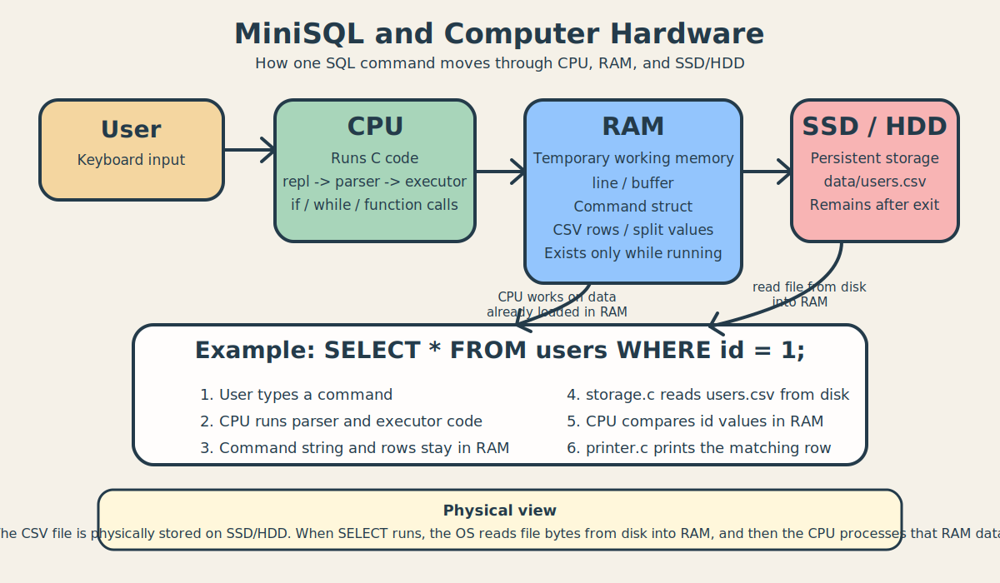

# MiniSQL을 CPU / RAM / SSD 관점에서 이해하기

이 문서는 이 프로젝트를 "코드"만이 아니라, 실제 컴퓨터 부품과 연결해서 이해하기 위한 학습용 설명이다.



그림에서 특히 중요한 연결은 `SSD/HDD -> Example 박스`가 아니라, 정확히는 아래 흐름이다.

1. `users.csv` 파일은 물리적으로 SSD/HDD에 저장되어 있다.
2. `SELECT`가 실행되면 운영체제가 디스크에 있는 파일 내용을 읽는다.
3. 읽어온 바이트들은 RAM 안의 버퍼로 올라온다.
4. 그 다음에야 CPU가 RAM에 올라온 문자열 데이터를 검사한다.

즉 물리적으로는:

- 파일의 "원본 위치"는 SSD/HDD
- CPU가 직접 디스크를 계산하는 것은 아님
- 디스크 -> RAM -> CPU 순서로 움직인다고 이해하면 된다

그래서 그림의 Example 박스는 "어느 부품이 무엇을 하는지"를 요약한 것이고, 그 안의 4번 단계인 `storage.c reads users.csv from disk`가 바로 SSD/HDD와 연결되는 부분이다.

핵심 질문은 이것이다.

- 이 프로그램이 실행될 때 CPU는 무엇을 하는가?
- RAM에는 무엇이 올라가는가?
- `users.csv`는 어디에 저장되는가?

## 아주 짧게 요약
- `CPU`: 코드를 실행한다.
- `RAM`: 실행 중 잠깐 필요한 데이터가 올라간다.
- `SSD/HDD`: 프로그램이 꺼져도 남아 있어야 하는 데이터를 저장한다.

우리 프로젝트에 대입하면:

- `repl.c`, `parser.c`, `executor.c`, `storage.c`, `printer.c`의 코드는 CPU가 실행한다.
- 입력 문자열, 버퍼, 구조체, 배열은 RAM에 잠깐 저장된다.
- [users.csv](../data/users.csv)는 SSD/HDD에 저장된다.

## 1. CPU는 이 프로젝트에서 무엇을 하나?
CPU는 "C 코드를 실제 동작으로 바꾸는 역할"을 한다.

예를 들어 사용자가:

```text
MiniSQL> SELECT * FROM users WHERE id = 1;
```

를 입력하면 CPU는 대략 이런 일을 순서대로 한다.

1. [main.c](../src/main.c)의 `main()` 실행
2. [repl.c](../src/repl.c)의 `run_repl()` 실행
3. 입력을 읽고 문자열 정리
4. [parser.c](../src/parser.c)의 `parse_command()` 실행
5. `SELECT` 문장인지 판단
6. [executor.c](../src/executor.c)의 `execute_select()` 실행
7. [storage.c](../src/storage.c)의 `read_user_row_by_id()` 실행
8. B-tree가 찾은 위치의 한 줄을 RAM으로 읽어오고
9. [printer.c](../src/printer.c)로 출력

즉 CPU는:

- 함수 호출하기
- 조건문 판단하기
- 반복문 돌리기
- 문자열 비교하기
- 파일 읽기/쓰기 요청하기

같은 일을 한다.

## 2. RAM에는 무엇이 올라가나?
RAM은 "실행 중 잠깐 쓰는 작업 공간"이라고 보면 된다.

이 프로젝트에서 RAM에 올라가는 대표적인 것들은:

- 사용자가 방금 입력한 한 줄 문자열
- 여러 줄 입력을 누적한 버퍼
- `Command` 구조체
- CSV 파일에서 읽어온 한 줄 데이터
- `split_csv_row()`로 나눈 컬럼 값들

예를 들어 [repl.c](../src/repl.c)에는 이런 식의 변수가 있다.

- `char *line;`
- `char *buffer;`

이 변수들은 실행 중 RAM에 만들어진다.

[executor.c](../src/executor.c) 쪽에서도:

- `RowArray row_array;`
- `char *values[USER_COLUMN_COUNT];`

같은 배열이 RAM에 올라간다.

즉 CSV 파일을 읽더라도, CPU가 바로 디스크에서 계산하는 것이 아니라:

1. 디스크에서 내용을 읽어 RAM으로 가져오고
2. RAM 안의 데이터를 CPU가 처리하는 구조이다.

## 3. SSD/HDD에는 무엇이 저장되나?
SSD/HDD는 "전원이 꺼져도 남는 저장 공간"이다.

이 프로젝트에서는 대표적으로:

- [users.csv](../data/users.csv)

가 SSD/HDD에 저장된다.

즉 `INSERT`를 하면:

- 프로그램이 값을 RAM에서 잠깐 처리한 뒤
- 최종적으로 `users.csv` 파일에 기록한다.

그러면 프로그램이 종료되어도 데이터는 파일에 남는다.

반대로 `SELECT`를 하면:

- SSD/HDD에 있는 `users.csv`를 다시 읽어서
- RAM으로 가져오고
- 그다음 CPU가 조건 비교를 수행한다.

## 4. INSERT는 물리적으로 어떻게 동작하나?
예를 들어 사용자가 아래 명령을 입력했다고 하자.

```sql
INSERT INTO users VALUES ("hong13", "Hong", 26, "010-1313-1414", "hong@example.com");
```

이때 내부에서는 대략 이런 일이 일어난다.

1. 키보드 입력이 프로그램으로 들어온다.
2. 입력 문자열이 RAM의 `line`, `buffer` 같은 공간에 저장된다.
3. CPU가 `parse_insert()`를 실행해서 문장을 분석한다.
4. 분석 결과가 `Command` 구조체에 담긴다.
5. CPU가 `execute_insert()`를 실행한다.
6. `append_user_record()`가 새 `id`를 자동 생성하고 `users.csv` 파일을 연다.
7. 값들을 CSV 문자열 형태로 변환해서 SSD/HDD에 기록한다.
8. `Inserted 1 row` 메시지를 화면에 출력한다.

핵심은:

- 파싱과 검사는 CPU + RAM
- 영구 저장은 SSD/HDD

## 5. SELECT는 물리적으로 어떻게 동작하나?
예를 들어:

```sql
SELECT * FROM users WHERE id = 1;
```

이 명령이 들어오면:

1. 입력 문자열이 RAM에 저장된다.
2. CPU가 `parse_select()`를 실행한다.
3. `WHERE id = 1` 조건이 `Command` 구조체에 저장된다.
4. `execute_select()`가 B-tree 인덱스로 `id = 1`의 파일 위치를 찾는다.
5. `read_user_row_by_id()`가 디스크에 있는 CSV의 해당 한 줄만 RAM으로 읽어온다.
6. `split_csv_row()`가 그 한 줄을 칼럼으로 나눈다.
7. `print_user_row()`가 결과를 출력한다.

즉 `SELECT`는:

- 디스크에서 읽기
- 메모리에서 비교
- 화면으로 출력

의 흐름이라고 볼 수 있다.

## 6. 왜 RAM과 SSD를 구분해서 이해해야 하나?
이걸 구분하면 DB 처리 흐름이 더 명확해진다.

- RAM은 빠르지만 전원이 꺼지면 사라진다.
- SSD/HDD는 느리지만 전원이 꺼져도 남는다.

그래서 DB 같은 프로그램은 보통:

- 작업할 때는 RAM을 쓰고
- 보존할 때는 디스크에 쓴다.

우리 프로젝트도 아주 작은 규모지만 같은 원리로 움직인다.

## 7. 이 프로젝트를 한 문장으로 하드웨어와 연결해서 말하면
이 프로젝트는 사용자가 입력한 MiniSQL 문장을 CPU가 해석하고, RAM에서 중간 데이터를 처리한 뒤, SSD/HDD의 CSV 파일에 저장하거나 다시 읽어서 결과를 출력하는 작은 SQL 처리기이다.

## 8. 발표 때 이렇게 설명해도 좋다
"이 프로그램은 사용자가 MiniSQL을 입력하면 CPU가 파서와 실행기를 통해 명령을 해석하고, 실행 중 필요한 문자열과 구조체는 RAM에 잠깐 올려서 처리합니다. 그리고 실제 사용자 데이터는 SSD/HDD에 있는 `users.csv` 파일에 저장되므로, 프로그램이 종료되어도 데이터가 유지됩니다."
