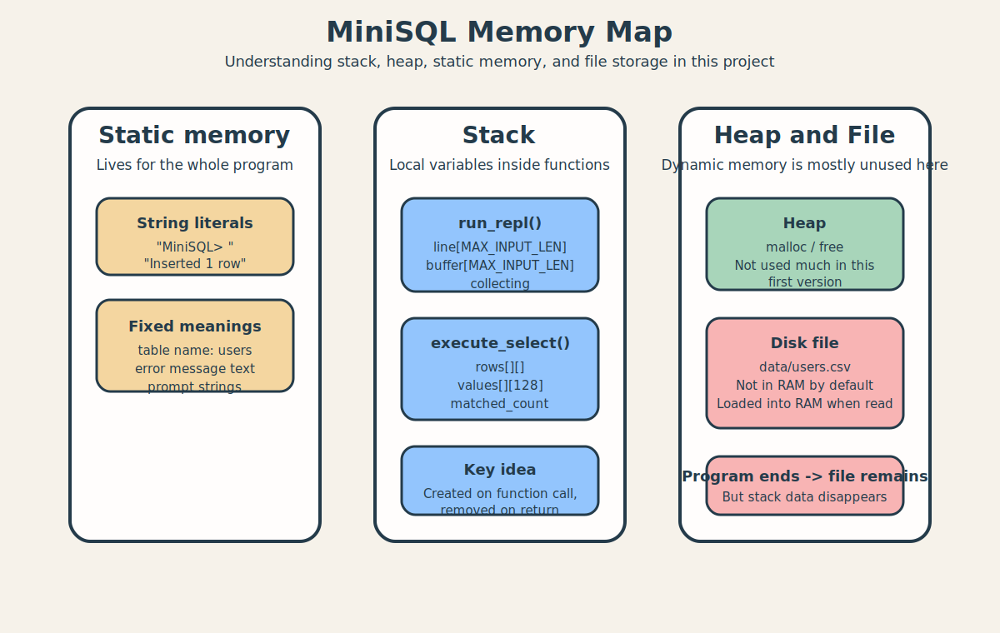

# Stack / Heap / Static Memory를 이 프로젝트로 이해하기

이 문서는 C를 처음 배우는 사람이 자주 헷갈리는 개념인 `stack`, `heap`, `static memory`를 이 프로젝트 코드와 연결해서 설명하기 위한 학습용 문서이다.



핵심 질문은 이것이다.

- 함수 안에 선언한 변수는 어디에 저장되는가?
- 전역 상수나 문자열은 어디에 있는가?
- `malloc()`을 어디에서 쓰고, 왜 `free()`가 필요한가?

## 아주 짧게 요약
- `stack`: 함수가 실행될 때 잠깐 생기는 지역 변수 공간
- `heap`: 필요할 때 직접 동적 할당해서 쓰는 공간
- `static memory`: 프로그램 시작부터 끝까지 유지되는 전역 데이터나 문자열, 정적 데이터 영역

현재 프로젝트는 여전히 `stack`과 `static memory`를 많이 사용하지만, 긴 입력 버퍼와 CSV row/field 저장에는 `heap`도 부분적으로 사용한다.

## 1. Stack이란?
Stack은 보통 함수가 호출될 때 만들어지는 지역 변수 공간이라고 이해하면 된다.

예를 들어 [repl.c](../src/repl.c)의 `run_repl()` 안에는 이런 변수가 있다.

- `char *line;`
- `char *buffer;`
- `int collecting = 0;`

이런 변수들은 `run_repl()` 함수가 실행되는 동안 stack에 놓인다.

즉:

- 함수 시작 -> 지역 변수 생성
- 함수 종료 -> 지역 변수 사라짐

이라고 이해하면 된다.

## 2. 이 프로젝트에서 stack에 올라가는 대표 예시
### [main.c](../src/main.c)
- `main()` 자체는 지역 변수가 거의 없다.

### [repl.c](../src/repl.c)
- `line`
- `buffer`
- `collecting`
- `command`, `parse_status`, `exec_status` 같은 지역 변수

### [executor.c](../src/executor.c)
- `row_array`
- `matched_count`
- `values`

### [storage.c](../src/storage.c)
- `buffer`
- `column`
- `row_offset`

즉 지역 변수 자체는 stack에 놓이지만, 그 지역 변수가 가리키는 동적 메모리는 heap에 있을 수 있다.

## 3. Heap이란?
Heap은 프로그램이 실행 중에 필요할 때 직접 메모리를 요청해서 쓰는 공간이다.

보통 C에서는:

```c
malloc(...)
calloc(...)
realloc(...)
free(...)
```

같은 함수를 써서 heap을 다룬다.

예를 들어:

```c
char *name = malloc(100);
```

이건 "문자열 100바이트를 heap에 달라"는 뜻이다.

그리고 다 쓴 뒤에는:

```c
free(name);
```

으로 해제해야 한다.

## 4. 이 프로젝트에서 heap은 어디에 쓰이나?
이번 버전에서는 아래처럼 heap이 실제로 사용된다.

- [repl.c](../src/repl.c)
  - `read_input_line()`이 긴 입력 문자열을 `malloc`/`realloc`으로 읽는다.
  - `append_input_line()`이 여러 줄 입력 버퍼를 `realloc`으로 늘린다.
- [parser.c](../src/parser.c)
  - 각 값 문자열을 `malloc`으로 복사해서 `Command` 구조체에 넣는다.
- [storage.c](../src/storage.c)
  - CSV 전체 조회 시 row 배열과 각 row 문자열을 동적으로 저장한다.
  - `split_csv_row()`가 각 칼럼 문자열을 동적으로 만든다.

예:

```c
char *line;
char *buffer;
char *values[USER_COLUMN_COUNT];
```

즉 이번 버전은 "구조는 단순하게 유지하되, 길이가 가변적인 데이터만 heap으로 옮긴 상태"라고 볼 수 있다.

장점:

- 긴 입력을 유연하게 받을 수 있다.
- CSV row 수가 늘어나도 필요한 만큼만 메모리를 사용한다.
- 문자열 길이만큼만 메모리를 쓸 수 있다.

단점:

- `malloc`, `realloc`, `free`를 신경 써야 한다.
- 메모리 해제를 빼먹으면 누수가 생긴다.

그래서 지금 프로젝트는 "완전 동적 메모리 중심"까지는 아니지만, 필요한 부분에는 heap을 도입한 절충형 설계이다.

## 5. Static memory란?
Static memory는 프로그램이 시작될 때부터 끝날 때까지 유지되는 데이터 영역이라고 생각하면 된다.

대표적으로 이런 것들이 들어간다.

- 전역 변수
- `static` 전역/함수 내부 변수
- 문자열 리터럴
- 상수 데이터

예를 들어 코드에 이런 문자열이 있으면:

```c
"Inserted 1 row"
"Error: missing semicolon"
"users"
```

이런 문자열 리터럴은 보통 static한 영역에 놓인다.

또 [constants.h](../include/constants.h)의 매크로를 통해 참조되는 프롬프트 문자열이나 파일 경로도 프로그램 전반에서 같은 의미로 사용된다.

## 6. 이 프로젝트에서 static memory로 생각하면 좋은 것들
- `"MiniSQL> "` 같은 프롬프트 문자열
- `"Error: ..."` 형태의 고정 오류 메시지
- `"users"` 같은 하드코딩 테이블명
- 코드 안에 직접 적힌 문자열 리터럴들

이 값들은 어떤 함수가 끝났다고 없어지는 게 아니라, 프로그램 실행 중 계속 참조될 수 있다.

## 7. 왜 지역 배열은 stack이고, 문자열 리터럴은 static인가?
예를 들어:

```c
char *line;
puts("Inserted 1 row");
```

이 경우:

- `line` 변수 자체는 함수 안 지역 변수이므로 stack
- 하지만 `line`이 가리키는 실제 문자열 메모리는 heap에 있을 수 있다
- `"Inserted 1 row"`는 코드에 박혀 있는 문자열 리터럴이므로 static memory

같은 코드 안에 있어도 저장되는 메모리 영역이 다르다.

## 8. 파일은 memory가 아니라 디스크에 있다
중요한 점 하나 더 있다.

[users.csv](../data/users.csv)는 stack도 아니고 heap도 아니고 static memory도 아니다.  
이 파일은 SSD/HDD 같은 저장장치에 존재한다.

단, 파일을 읽는 순간:

- 한 줄이 `buffer` 같은 동적 메모리 공간으로 올라오면 heap/RAM에 올라오고
- CPU는 그 stack 데이터를 처리한다.

즉:

- 파일 자체는 디스크
- 읽어온 데이터는 메모리

라고 구분해야 한다.

## 9. 함수 호출과 stack의 관계
함수가 호출되면 stack frame이라는 실행 공간이 생긴다고 설명하기도 한다.

예를 들어:

1. `main()`
2. `run_repl()`
3. `process_input_line()`
4. `parse_command()`

순서로 호출되면, 각 함수마다 자기 지역 변수 공간이 생긴다.

그리고 함수가 끝나면 그 함수의 지역 변수 공간은 사라진다.

그래서 어떤 함수 안의 지역 배열 주소를 바깥에서 오래 들고 있으면 위험할 수 있다.

이 프로젝트에서는 그런 위험한 패턴을 줄이기 위해:

- `free_command()`
- `free_row_array()`
- `free_csv_values()`

같은 정리 함수를 따로 두고 사용이 끝난 동적 메모리를 해제한다.

## 10. 왜 heap을 부분적으로만 쓰는가?
너처럼 C를 이제 막 배우는 단계에서는 모든 데이터를 heap으로 바꾸면 난이도가 너무 급격하게 올라간다.

왜냐하면 heap을 쓰기 시작하면:

- `malloc()` 성공 여부 확인
- `free()` 해제 타이밍
- 메모리 누수
- 이중 해제
- dangling pointer

같은 문제까지 같이 봐야 하기 때문이다.

그래서 지금 프로젝트는:

- 전체 구조는 유지하고
- 긴 입력, CSV row, 문자열 값처럼 꼭 필요한 부분만 heap으로 옮긴

중간 단계 설계라고 볼 수 있다.

## 11. 나중에 heap을 더 쓰게 된다면 어디가 바뀔까?
지금보다 더 확장하면 이런 부분이 추가로 heap 중심으로 바뀔 수 있다.

- 매우 긴 입력 문자열 동적 확장
- 행 개수를 모를 때 동적 배열 사용
- 여러 테이블을 위한 유연한 스키마 구조
- CSV 컬럼 값을 동적으로 저장

즉 지금은 "부분적 heap 도입" 상태이고, 나중에 더 큰 프로그램으로 가면 heap 비중이 더 커질 수 있다.

## 12. 이 프로젝트를 메모리 관점에서 한 문장으로 말하면
이 프로젝트는 지역 변수와 제어 흐름은 stack으로 처리하고, 긴 입력과 CSV row/field 같은 가변 데이터는 heap으로 관리하며, 고정 문자열은 static memory에 두고, 영구 데이터는 SSD/HDD의 CSV 파일에 저장하는 MiniSQL 처리기이다.

## 13. 발표 때 이렇게 설명해도 좋다
"현재 구현은 구조를 단순하게 유지하면서도 긴 입력과 CSV 데이터 처리를 위해 필요한 곳에는 `malloc`과 `realloc`을 도입했습니다. 즉 제어 흐름은 여전히 읽기 쉽게 유지하되, 가변 길이 데이터는 heap으로 관리하는 절충형 구조입니다."
