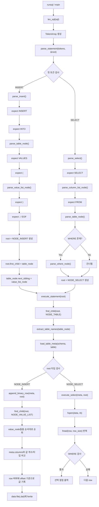

```mermaid
flowchart TD
    A["runsql / main"] --> B["lex_sql(sql)"]
    B --> C["TokenArray 생성"]
    C --> D["parse_statement(tokens, &root)"]
    D --> E{"첫 토큰 검사"}
    E -->|INSERT| F["parse_insert()"]
    E -->|SELECT| G["parse_select()"]

    F --> F1["expect INSERT"]
    F1 --> F2["expect INTO"]
    F2 --> F3["parse_table_node()"]
    F3 --> F4["expect VALUES"]
    F4 --> F5["expect ("]
    F5 --> F6["parse_value_list_node()"]
    F6 --> F7["expect )"]
    F7 --> F8["expect ; / EOF"]
    F8 --> F9["root = NODE_INSERT 생성"]
    F9 --> F10["root.first_child = table_node"]
    F10 --> F11["table_node.next_sibling = value_list_node"]

    G --> G1["expect SELECT"]
    G1 --> G2["parse_column_list_node()"]
    G2 --> G3["expect FROM"]
    G3 --> G4["parse_table_node()"]
    G4 --> G5{"WHERE 존재?"}
    G5 -->|Yes| G6["parse_where_node()"]
    G5 -->|No| G7["건너뜀"]
    G6 --> G8["root = NODE_SELECT 생성"]
    G7 --> G8

    F11 --> H["execute_statement(root)"]
    G8 --> H

    H --> I["find_child(root, NODE_TABLE)"]
    I --> J["extract_table_names(table_node)"]
    J --> K["load_table_meta(schema, table)"]
    K --> L{"root 타입 검사"}

    L -->|NODE_INSERT| M["append_binary_row(meta, root)"]
    L -->|NODE_SELECT| N["execute_select(meta, root)"]

    M --> M1["find_child(root, NODE_VALUE_LIST)"]
    M1 --> M2["value_node들을 순서대로 순회"]
    M2 --> M3["meta.columns와 값 개수/타입 비교"]
    M3 --> M4["row 버퍼에 offset 기준으로 값 기록"]
    M4 --> M5["data file(.dat)에 fwrite"]

    N --> N1["fopen(data, rb)"]
    N1 --> N2["fread(row, row_size) 반복"]
    N2 --> N3{"WHERE 검사"}
    N3 -->|통과| N4["선택 컬럼 출력"]
    N3 -->|실패| N5["다음 row"]

```